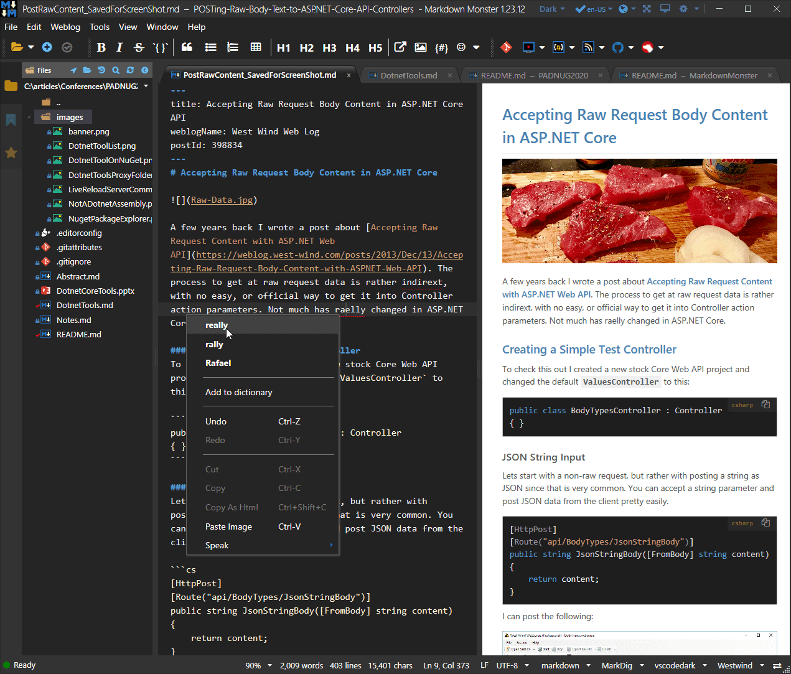
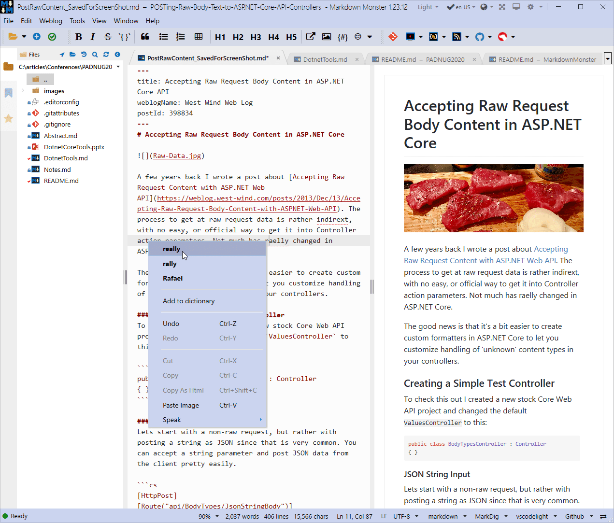
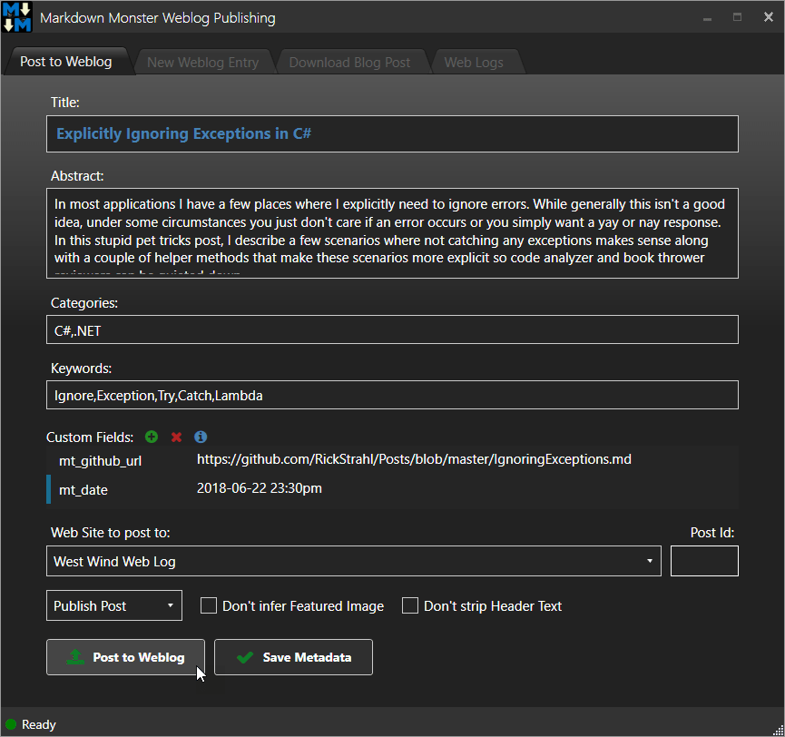
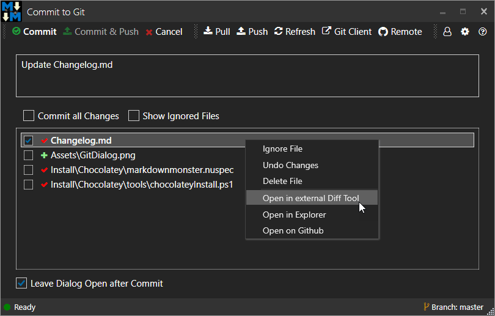
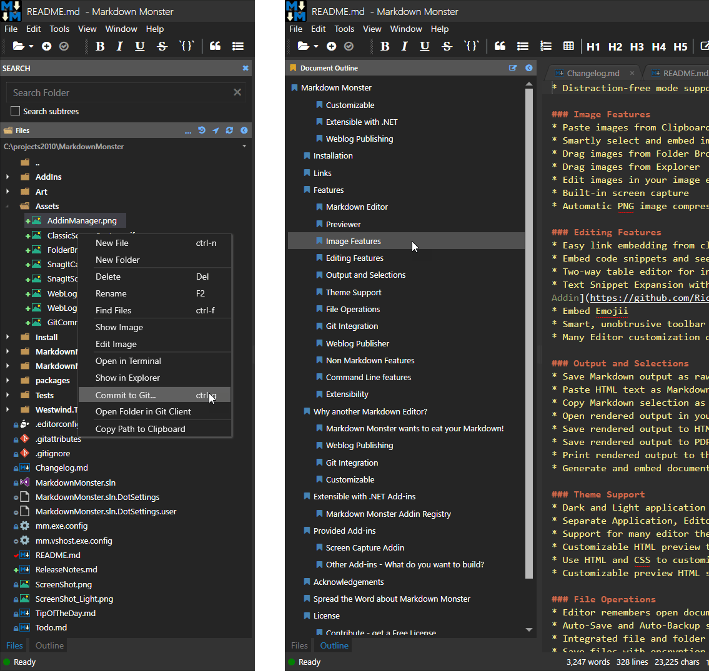
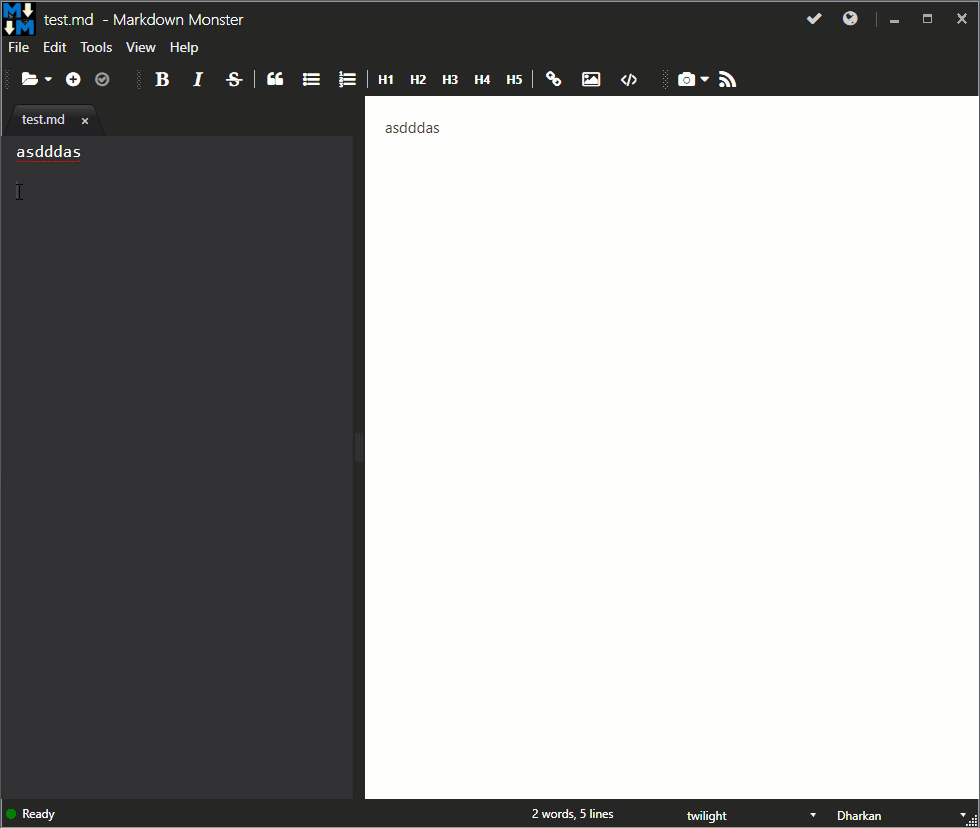
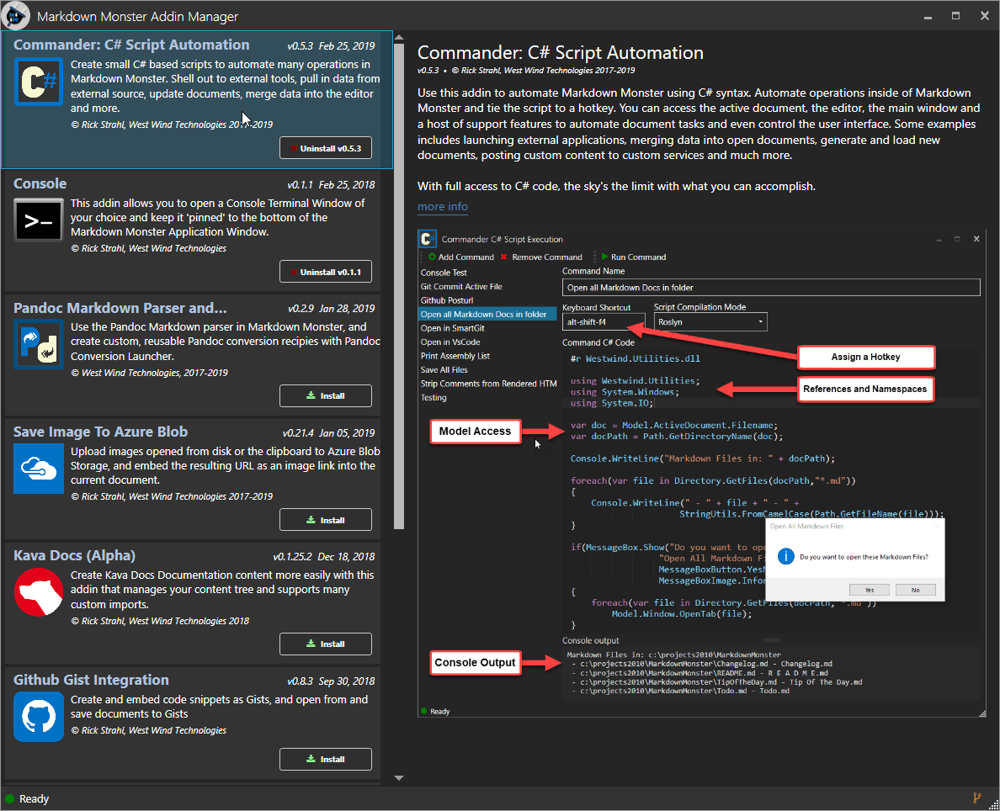

# Markdown Monster

[](https://markdownmonster.west-wind.com/download)
[](https://chocolatey.org/packages/MarkdownMonster)
[](https://chocolatey.org/packages/MarkdownMonster)
[ ](https://gitter.im/MarkdownMonster/MarkdownMonster)


Markdown Monster is an easy to use and extensible **Markdown Editor**, **Viewer** and **Weblog Publisher** for Windows. Our goal is to provide the best Markdown specific editor for Windows and make it as easy as possible to create Markdown documents. We provide a core editor and previewer, and a number of non-intrusive helpers to help embed content like images, links, tables, code and more into your documents with minimal effort.

* [See what's new](https://github.com/RickStrahl/MarkdownMonster/blob/master/Changelog.md)  
* [License](#license)

## Installation

### Download Installer
You can download Markdown Monster using the self-contained installer:

[Download Markdown Monster](http://markdownmonster.west-wind.com/download)

### Chocolatey

You can you use [Chocolatey](https://chocolatey.org/) to install from the Windows Command Prompt:

```ps
c:\> choco install markdownmonster
```

### Scoop
You can use [Scoop](https://scoop.sh/) to install and update from the Windows Command Prompt. You need to use the `extras` bucket. 

```ps
c:\> scoop install markdown-monster
```

## License
Markdown Monster is a licensed product and while we provide a fully functional, free download, for continued use a reasonably priced license is required.

For more detailed info on licensing please visit licensing information here:

[Markdown Monster Licensing](https://markdownmonster.west-wind.com/purchase#License)

## Overview
Here's what Markdown Monster looks like using the default **Dark Theme**: 



and here is the **Light Theme**:



<small>*Note that you can individually customize the theming for the editor, the preview and even the code snippet display in the previewer.*</small>

### Productive
Markdown Monster has a lot of features, but we work hard to keep those features out of your way when you don't need them. If you just want to write, MM provides a minimal editing experience that provides pleasant white space around your content and an optional distraction free mode. But if you want to be more productive use shortcuts and helpers to enhance your editing experience, we help you with many useful tools to enhance your editing experience with thoughtful productivity features. Most commands have keyboard shortcuts and can be accomplished with one or two keystrokes.

Easily embed things like images, links, tables, code snippets and more with a couple of keystrokes and smart link fix ups. Because images are such a big part of content creation, our image embedding support is especially rich and supports pasting images from the clipboard, embedding with the image file/url dialog, drag and drop from explorer or a browser, and even a built-in image capture utility.

### Customizable
Markdown Monster is highly customizable with themes for the main shell, editor and preview displays. The editor and preview themes can be easily customized using HTML and CSS based templates so you can make Markdown Monster your own. There are also many options to customize the editor's fonts, sizes and many display options.

You can also run in distraction free mode, that removes toolbars, menus, preview, sidebar and other distractions to let you focus on your code. Or use Presentation mode to focus on reading content without the editor view.
 
### Extensible
Markdown Monster is extensible with .NET code. You can use our Snippets or Commander addins to create custom text expansions, or automate common tasks using .NET Code snippets. A full addin extensibility model allows deep integration with most of Markdown Monster's features and UI to create sophisticated extensions using a straightforward Addin model. There is an Addin Manager that lets you easily install, update and manage available Addins.

### Weblog Publishing
If you have a blog chances are you can use Markdown Monster to create your content and publish it to your blogging service. Markdown Monster can publish to many common Weblog engines including WordPress, Medium and any service that use MetaWeblog API. MM automatically handles converting your Markdown content to HTML, fixing up links and publishing and re-publishing your Markdown content cleanly to blogging services.

The **New Weblog Post** feature automatically sets up a post folder in a Weblog Posts directory hierarchy to let you organize posts in a shared DropBox or OneDrive (if available) folder so you can easily work on posts from multiple machines.

Markdown Monster's integrated Git features also work great for  any Git based service like Jekyll, Ghost, Hugo or Wyam to write your posts locally and immediately push them to your remote Git repository to publish. Git integration is built into MM to commit your changes either individually or in batch or you can open your favorite Git Client to publish your changes to your hosted content blog.

## Links
* **[Markdown Monster Site](http://markdownmonster.west-wind.com)**
* **[What's New Change Log](Changelog.md)**
* **[Documentation](https://markdownmonster.west-wind.com/docs/)**
* **[Bug Reports & Feature Requests](https://github.com/rickstrahl/MarkdownMonster/issues)**
* **[Support Forum for Questions & Discussions](http://support.west-wind.com?forum=Markdown+Monster)**
* **[License](#license)**

* **[Video: Getting Started with Markdown Monster ](https://www.youtube.com/watch?v=XjFf57Ap9VE)** (old) 
* **[Follow @MarkdownMonstr on Twitter](https://twitter.com/markdownmonstr)**

#### Addins
* **[Markdown Monster Addin Registry](https://github.com/RickStrahl/MarkdownMonsterAddinsRegistry)**  
* **[Create Addins with .NET](http://markdownmonster.west-wind.com/docs/_4ne0s0qoi.htm)**
> ### Show your Support
> If you like what you see here, please consider **starring this repo** (click the :star: in the top right corner of this page). If you have a favorite feature in Markdown Monster, it'd be awesome if you could tweet about it and mention [@markdownmonstr](https://twitter.com/markdownmonstr). Please help us spread the word. 


> ### Please report any Issues you run into!
> If you run into a problem with Markdown Monster, **please** let us know by [filing an issue](https://github.com/rickstrahl/MarkdownMonster/issues) or feature request here on GitHub. We want to know what doesn't work and get it fixed. **Help us make Markdown Monster better**! We know your time is valuable, but we really appreciate any feedback.


## Features
Markdown Monster provides many useful features:

### Markdown Editor
* Syntax highlighted Markdown editing 
* Live and synced HTML preview 
* Gentle, optional toolbar support for Markdown newbies
* Inline spell checking
* Line and Word counts
* Synced Document Outline
* Distraction free mode
* Markdown folding
* Split view

### Previewer
* Scroll synced preview window
* Optional external previewer for multi-screen
* Preview in Web Browser
* Presentation mode support
* Distraction-free mode support
* Document Navigation from embedded Markdown Links

### Image Features
* Paste images from Clipboard
* Smartly select and embed images from disk or URL
* Drag images from Folder Browser
* Drag images from Explorer
* Edit images in your image editor of choice
* Built-in screen capture
* Automatic image compression on pasted images

### Editing Features
* Easy link embedding from clipboard or disk
* Embed code snippets and see highlighted syntax coloring
* Two-way table editor for interactively creating and editing tables
* Text Snippet Expansion with C# Code via [Snippets Addin](https://github.com/RickStrahl/Snippets-MarkdownMonster-Addin)
* Embed Emojii
* Smart, unobtrusive toolbar and shortcut key helpers
* Snippet expansion from text templates
* Document Outline to navigate large documents
* Many Editor customization options

### Output and Selections
* Save rendered output to self-contained HTML or HTML Fragment
* Save rendered output to PDF
* Copy Markdown selection as HTML
* Paste HTML text as Markdown
* Open rendered output in your favorite Web browser
* Print rendered output to the printer or PDF driver
* Generate and embed document Table of Contents

### Theme Support
* Dark and Light application themes
* Customizable Editor Themes
* Customizable Preview Themes
* Customizable output syntax coloring themes
* Each type of theme can be individually applied
* Use HTML and CSS to customize Preview and Editor Themes

### File Operations
* Editor remembers open documents by default (optional)
* Auto-Save and Auto-Backup support
* Many file operations on each file
    * Shell Viewer
    * Open With...
    * Edit in appropriate editors
    * View/Edit Images in configured apps
    * Compress images
    * Commit to Git
    * Open on Github (if Github repo)
* Save files with encryption
* Drag and drop documents from Explorer and Folder Browser
* Open a Terminal, Explorer or Git Client

### Organization and File Access
* Integrated File and Folder browser
* Quick File Search
* Find in Files (search files and content)
* Favorites Sidebar - save, organize and search
* Group files into Projects
* Drag and Drop files everywhere

### Git Integration
* Show Git Status in Folder Browser
* Commit and push Dialog
* Commit and push active file, folder browser file
* Commit and push all pending changes
* Compare changes in configured Git Diff client
* Undo Changes
* Add Ignored Files
* Clone Repository
* Open in Git Client

### Weblog Publishing
* Create or edit Weblog posts using Markdown
* Publish your Markdown directly to your blog
* Re-publish posts at any time
* Post data stored as YAML metadata in Markdown
* Send custom meta data with posts
* Supports MetaWebLog, Wordpress and Medium (limited)
* Supports document based blogs (Jekyll, Hugo, Wyam, Ghost etc.)
* Download and edit existing posts
* Very fast publish and download process
* Support for multiple blogs
* Dropbox and OneDrive shared post storage

### Non Markdown Features
* HTML file editing with live preview
* Many other file formats can also be edited:  
JSON, XML, CSS, JavaScript, Typescript, FoxPro, CSharp and more
* Optional shared configuration on Cloud drives
* High DPI Monitor Aware

### Command Line features
* Use `mm` or `markdown` to launch Markdown Monster
* Markdown Monster path added to user path
* `mm readme.md` - open single file
* `mm readme.md changelog.md` - open multiple files
* `mm .` - open folder browser in current folder
* `mm reset` - reset all Markdown Monster settings
* `mm uninstall` - remove all non-local system settings


### Extensibility
* Automate Markdown Monster with C# using the [Commander Addin](https://github.com/RickStrahl/Commander-MarkdownMonster-Addin)
* Create Addins with .NET code
* Visual Studio Project Template available
* Simple interface, easy to implement
* Access UI, menu and active documents
* Access document and application lifecycle events
* Add Custom Markdown Parsers
* Replace the Preview Rendering Engine
* Add Tabs to left and right sidebar panels
* Some published addins available:
    * [Console: A pinned Terminal Window](https://github.com/RickStrahl/Console-MarkdownMonster-Addin)
    * [Commander: C# based Script Automation](https://github.com/RickStrahl/Commander-MarkdownMonster-Addin)
    * [Gist: Open from and Save As Gists, and Paste Code as Gist](https://github.com/RickStrahl/PasteCodeAsGist-MarkdownMonster-Addin)
    * [Save Image to Azure Blob Storage](https://github.com/RickStrahl/SaveToAzureBlob-MarkdownMonster-Addin)


## Why another Markdown Editor?
Markdown is everywhere these days, and it's becoming a favorite format for many developers, writers and documentation experts to create lots of different kinds of content in this format. Markdown is used in a lot of different places:

* Source Code documentation files (like this one)
* Weblog posts
* Product documentation
* Message Board message entry
* Application text entry for formatted text

Personally I use Markdown for my Weblog, my message board, of course on GitHub and in a number of applications that have free form text fields that allow for formatted text - for example in our Webstore product descriptions are in Markdown. 

Having a dedicated Markdown Editor that gets out of your way, yet provides a few helpful features **and lets you add custom features** that make your content creation sessions more productive is important. [Check out this post](https://medium.com/markdown-monster-blog/why-use-a-dedicated-markdown-editor-1aff2aaad42) on why it makes sense to use a dedicated Markdown Editor rather than a generic text editor for Markdown document creation. The ability to easily publish your Markdown to any MetaWebLog or Wordpress API endpoint is also useful as it allows you to easily publish to blogs or any application that supports for either for these formats.

### Markdown Monster wants to eat your Markdown!
Markdown Monster is a Markdown editor and Viewer for Windows that lets you create edit or simply preview Markdown text. It provides basic editing functionality with a few nice usability features for quickly embedding images, links, code, tables, screen shots and other markup. You get a responsive text editor that's got you covered with Markdown syntax highlighting, a collapsible live preview, so you can see what your output looks like, inline spellchecking and a handful of optimized menu options that help you mark up your text and embed and link content into your Markdown document. Additionally utility features let you quickly jump to the command line or an Explorer window, commit a document to Git, or even edit images in your favorite image editor.

### Weblog Publishing
A common use case for Markdown is to create rich blog posts with embedded links and content and Markdown Monster makes it easy to pull together content from various sources. You can easily embed images by pasting from the the clipboard, or by linking images from URLs or files or using the built-in Screen Capture addin or [SnagIt](https://techsmith.com/snagit) support.

Writing long blog posts and articles, and coordinating lots of related content is one of the main reasons I built this tool in the first place as is publishing and updating content easily to various types of blogs and content generators.

You can take any Markdown and turn it into a blog post by using the Weblog publishing feature. If you use WordPress, a MetaWeblog API Blog, Medium or Jekyll, you can click the Weblog button on the toolbar and set up your blog (MetaWebLog, WordPress or Medium), and then specify the Weblog specifics like title, abstract, tags and Web Site to publish to. Posts can be easily published and also re-published with the click of a button. You can also download existing blog posts from your blog and edit them as Markdown and then republish them.




### Git Integration
These days working with Markdown often means working with Git repositories and Markdown Monster integrates common Git tasks that you need to perform during editing. You can easily review, commit and push changes, as well as cloning and creating of new repositories.



### Folder Browser
Markdown editing often requires managing related content like images, or multiple files for links etc. and Markdown Monster provides a folder browser to see and navigate files while in the editor. The browser has built-in Git status support so you can immediately see what documents have changed in your folder tree and you can easily review and undo changes. The browser lets you navigate folders, create, delete and move files and there are many options to view, open and edit files.

The folder browser also supports searching, moving and renaming of files as you would expect of a file browser.



### Document Outline
When working with long documents it's important to have an easy way to navigate the document's structure quickly, and the Document Outline makes it easy to see the document's structure at a glance and jump to any section quickly. The outline also lets you pick up document Ids for quickly embedding same-document links.

### Table Editor
Markdown Monster includes a powerful two-way table editor that lets you interactively edit content in tables. You can use the rich table editor to enter your Table content, and re-open Markdown table code in the editor for later editing and re-formatting.


### Screen Captures
The Screen Capture addin supports two separate capture modes: 

* Techsmith's popular and versatile [SnagIt](http://techsmith.com/snagit) Screen Capture Tool
* Built-in Screen Capture Addin 

To capture, simply click the capture button (camera icon) and the main app minimizes and either SnagIt or the integrated capture tool pops up to let you select the object to capture. With SnagIt you can use most of SnagIt's native capture modes, for the built-in tool you can select Windows and Controls on the screen. Captures are previewed and have options for editing, and when finished the captured image is embedded and linked directly into the Markdown content.


Here's the **SnagIt Screen Capture** in action:



And here is the self-contained, built-in Screen Capture Module:


### Customizable
Most editing and UI features in Markdown Monster are optional and can be turned on and off. Want to work distraction free and see no preview or spell checking hints? You can turn them off. Want to store configuration data in a shared cloud folder? You can do that too.

Want a different editor theme than the dark default or a preview theme that matches your blog or branding? You can easily switch to one of the many built-in editor themes. For previews you can use either one of several built-in themes or add your own with a simple, plain HTML/CSS template. You can even create themes that link to your own online styles.

The editor and previewer are HTML and JavaScript based, so you can also apply any custom styling and even hook up custom JavaScript code if you want to get fancy beyond the basic configuration. The preview themes are easy to modify as they are simply HTML and CSS templates.

## Extensible with .NET Add-ins
One of the **key feature** and the main reason I built Markdown Monster is that it is **extensible**, so that you and I can plug additional functionality into it without bloating the main product. 

You can find available public Addins you can install in the **Markdown Monster Addin Manager** from the **Tools** menu:  



There is a variety of functionality available in addins. Here are a few examples:

Right now the registry is pretty sparse, but here are a few Addins you can check out:

* [Console](https://github.com/RickStrahl/Console-MarkdownMonster-Addin)  
Lets you pin an always-active Terminal Console window to the bottom of Markdown Monster.

* [Commander C# Scripting](https://github.com/RickStrahl/Commander-MarkdownMonster-Addin)  
A C# based scripting addin that lets you automate tasks using script code. For simple tasks this is quicker and easier than creating a full addin.

* [Save Image to Azure Blob Storage](https://github.com/RickStrahl/SaveToAzureBlob-MarkdownMonster-Addin)  
Lets you save images as Azure Blob storage items and embeds a link to the an uploaded resoure into your Markdown.

* [Gist](https://github.com/RickStrahl/PasteCodeAsGist-MarkdownMonster-Addin)  
This addin allows you to **Open from Gist** and **Save as Gist** as well as letting you create code snippets and embed them as Gists into your Markdown content.

* [Pandoc Markdown Parser](https://github.com/RickStrahl/Pandoc-MarkdownMonster-Addin)  
This addin provides a PanDoc Markdown processor that can be used instead of the default MarkDig parser. This addin also provides a host of document conversion options to convert your Markdown to PDF, DOC, EPub and a few other formats using an interactive dialog.

### .NET Based Extensibility
Markdown Monster Addins have access to an add-in model that lets you manipulate and automate any open documents and the editor, lets you load new documents, launch external processes, add menu options and other UI features, open a new sidebar, generally interact with the entire UI and attach to life cycle events to get notifications of various application events like documents opening and closing, documents being saved and the application shutting down, etc...

Complexity of Addins can vary greatly from very simple automation tools like the Console Addin that simply pins a Terminal window to Markdown Monster, or something as complex as the KavaDocs addin that manages an entire documentation application with many custom windows and sidebars that are integrated into Markdown Monster.

Addins have access to most features of Markdown Monster and they are fairly easy to create. We as well as several third parties have created a number of useful addins using the powerful addin model and I encourage you to browse addins to see what you can do.

### Creating Addins
One of the key features of Markdown Monster is that you can also create your own addins using the .NET based Markdown Monster Addin model. It's very easy to create new addins and we provide a [Visual Studio Project Template Extension](https://marketplace.visualstudio.com/items?itemname=rickstrahl.markdownmonsteraddinproject) to facilitate the process of getting started with creating an Addin. All of our plug-ins are also available on GitHub, so you can easily check out how other addins were created.

You can find documentation for creating Addins here:

* [Creating a Markdown Monster Addin](http://markdownmonster.west-wind.com/docs/_4ne0s0qoi.htm)
* [Markdown Monster Addin Visual Studio Project Template](https://marketplace.visualstudio.com/items?itemName=RickStrahl.MarkdownMonsterAddinProject)
* [Accessing and Manipulating the Active Editor](http://markdownmonster.west-wind.com/docs/_4nf02q0sz.htm)
* [Bringing up UI from your Addin](http://markdownmonster.west-wind.com/docs/_4ne1ch7wa.htm)


### Markdown Monster Addin Registry
You can create addins for your own use, simply by copying them into the `%appdata%\Addins` folder, or if you created an Addin that you think might be useful for others you can publish on the [Markdown Monster Addin Registry](https://github.com/RickStrahl/MarkdownMonsterAddinsRegistry). The registry holds public Addins that show in the Addin Manager inside of Markdown Monster:

You can find out more on how to publish your Addins in this GitHub repository:

* [Markdown Monster Addin Registry](https://github.com/RickStrahl/MarkdownMonsterAddinsRegistry)


### Other Add-ins - What do you want to build?
I can think of a few add-in ideas - a quick way to commit to Git and Push would be useful for documentation solutions, or Git based blogs, so you can easily persist changes to a GitHub repository. Embedding all sorts of content like reference links, AdSense links, Amazon product links, a new post template engine, etc., etc.

Or maybe you have custom applications that use Markdown text and provide an API that allows you to post the Markdown (or HTML) to the server. It's easy to build a custom add-in that lets you take either the Markdown text or rendered HTML and push it to a custom REST interface in your custom application.

## Acknowledgements
This application heavily leans several third party libraries without which this tool would not have been possible. Many thanks for the producers of these libraries that are used extensively in Markdown Monster:

* **[Ace Editor](https://ace.c9.io)**  
Ace Editor is a power HTML based editor platform that makes it easy to plug syntax highlighted software style editing possible in a browser. Markdown Monster uses Ace Editor for the main Markdown editing experience inside of a Web browser control that interacts with the WPF application.

* **[MarkDig Markdown Parser](https://github.com/lunet-io/markdig)**  
This extensible Markdown parser library is used for the rendering Markdown to HTML in Markdown Monster. The library is fast and supports a number of useful extensions like GitHub Flavored Markdown, table support, auto-linking and various add-on protocols. The feature set is extensible via a plug-in pipeline. 

* **[MahApps.Metro](http://mahapps.com/)**  
This library provides the Metro style window and theming support of the top level application shell. It's an easy to use library that makes it a snap to build nice looking WPF applications.

* **[Dragablz](https://dragablz.net/)**  
This library provides the tab control support for the editor allowing for nicely styled tab reordering and overflow. The library also supports tab tear off tabs and layout docking although this feature is not used in Markdown Monster.

* **[nHunspell Spell Checking](http://www.crawler-lib.net/nhunspell)**  
Spell checking is handled via the hunspell library and the .NET wrapper in nhunspell. This library checks for mispellings and provides lookups for misspelled words. Word parsing is done in JavaScript and the spell checking is done in .NET by piping word lists to .NET to check which is drastically faster than doing the spell checking in the browser using JavaScript.

Additional shout outs to these libraries used:

* [HtmlAgility Pack](https://html-agility-pack.net/)
* [LibGit2Sharp](https://github.com/libgit2/libgit2sharp)
* [YamlDotnet](https://github.com/aaubry/YamlDotNet)
* [Windows API Codepack](https://github.com/aybe/Windows-API-Code-Pack-1.1)
* [FontAwesome.WPF](https://github.com/charri/Font-Awesome-WPF/)
* [ReverseMarkdown](https://github.com/mysticmind/reversemarkdown-net)


## Spread the Word about Markdown Monster
If you like Markdown Monster please pass it on to help spread the word. Let your friends know, mention it to others who ask about Markdown and help us grow this community to encourage building the best Markdown Editor around.

Here are a few things you can do to help spread the word:

* **Follow us on Twitter**: [@MarkdownMonstr](https://twitter.com/markdownmonstr)
* **Tweet about Markdown Monster** and mention [@MarkdownMonstr](https://twitter.com/markdownmonstr)
* **Star this repo** by clicking on the Star icon in the header
* **Install from Chocolatey** with the [Markdown Monster Package](https://chocolatey.org/packages/MarkdownMonster)
* **Write an Addin**: [Create a Markdown Monster Addin](http://markdownmonster.west-wind.com/docs/_4ne0s0qoi.htm)
* **Write a blog post** and mention how you use Markdown Monster
* **Link to the [Markdown Monster Web Site](https://markdownmonster.west-wind.com)** to help us spread the Google Foo.

The support from the community so far with feedback, bug reports and ideas for new features has been awesome, and I look forward for that to continue with a growing community of active users and contributors.

## License

Markdown Monster comes in several license modes: Evaluation, Single User, Multiple User and Site License.

Markdown Monster is **Source Open** with source code available on GitHub, but it is a licensed product that requires a paid-for license for continued use. The software is licensed as © Rick Strahl, West Wind Technologies, 2015-2019. 

A fully functional, free evaluation version is available for evaluation use, but continued use requires purchase of a license. 

Licenses can be purchased from:  

https://store.west-wind.com/product/markdown_monster


#### Evaluation License

The Evaluation version has all the features and functionality of the registered version, except that it shows occasional freeware notices. Tampering with or removing of the notices is not allowed with the evaluation license.

You can use the evaluation version with the notices enabled, but if you use Markdown Monster regularly or for commercial use, please register and support further development and maintenance.

#### Purchased License

For continued or commercial use of Markdown Monster a paid-for license is required. The paid-for license removes the freeware notices.

Each licensed user must have a separate license, but a single user may use multiple copies of Markdown Monster on multiple machines.

The multi-user licenses work the same as a single user license applied to the number of users specified on the license purchased. An organizational site license is available to allow any number of users running unlimited numbers of Markdown Monster instances within a single organization.

Any purchased license is valid for the duration of the major release that it was purchased for (ie. 1.00-1.99) and minor version updates within that major version are always free. Upgrade pricing is available for major version upgrades, usually at half of full price, and it's our policy to allow for free upgrades to the next major version within a year of purchase.

#### Source Code

Markdown Monster is **Source Open** and source code is available on GitHub at https://github.com/RickStrahl/MarkdownMonster, but the licensing outlined above is applies regardless. We allow modification of source code for internal use of Markdown Monster in your organization or for submitting pull requests to the Markdown Monster main repository. Under no circumstances are you allowed to re-package and re-distribute any part of Markdown Monster outside of your organization.

#### Help us out - Get a free License

We encourage pull requests for feature suggestions or bug fixes to be submitted back to the Markdown Monster repository. Any contributors that provide meaningful enhancements, help with identifying and or fixing of bugs or by actively promoting Markdown Monster can qualify for a free license (at our discretion). Additionally Microsoft MVPs and Insiders and Microsoft Employees can [apply for a free license](https://markdownmonster.west-wind.com/download#contribute---get-a-free-license").

#### WARRANTY DISCLAIMER: NO WARRANTY!

YOU EXPRESSLY ACKNOWLEDGE AND AGREE THAT USE OF THE LICENSED APPLICATION IS AT YOUR SOLE RISK AND THAT THE ENTIRE RISK AS TO SATISFACTORY QUALITY, PERFORMANCE, ACCURACY AND EFFORT IS WITH YOU. TO THE MAXIMUM EXTENT PERMITTED BY APPLICABLE LAW, THE LICENSE APPLICATION AND ANY SERVICES PERFORMED OR PROVIDED BY THE LICENSED APPLICATION ("SERVICES") ARE PROVIDED "AS IS" AND "AS AVAILABLE," WITH ALL FAULTS AND WITHOUT WARRANTY OF ANY KIND, AND APPLICATION PROVIDER HEREBY DISCLAIMS ALL WARRANTIES AND CONDITIONS WITH RESPECT TO THE LICENSED APPLICATION AND ANY SERVICES, EITHER EXPRESS, IMPLIED OR STATUTORY, INCLUDING, BUT NOT LIMITED TO, THE IMPLIED WARRANTIES AND/OR CONDITIONS OF MERCHANTABILITY, OF SATISFACTORY QUALITY, OF FITNESS FOR A PARTICULAR PURPOSE, OF ACCURACY, OF QUIET ENJOYMENT, AND NON-INFRINGEMENT OF THIRD PARTY RIGHTS. APPLICATION PROVIDER DOES NOT WARRANT AGAINST INTERFERENCE WITH YOUR ENJOYMENT OF THE LICENSED APPLICATION, THAT THE FUNCTIONS CONTAINED IN, OR SERVICES PERFORMED OR PROVIDED BY, THE LICENSED APPLICATION WILL MEET YOUR REQUIREMENTS, THAT THE OPERATION OF THE LICENSED APPLICATION OR SERVICES WILL BE UNINTERRUPTED OR ERROR-FREE, OR THAT EFFECTS IN THE LICENSED APPLICATION OR SERVICES WILL BE CORRECTED. NO ORAL OR WRITTEN INFORMATION OR ADVICE GIVEN BY APPLICATION PROVIDER OR ITS AUTHORIZED REPRESENTATIVE SHALL CREATE A WARRANTY. SHOULD THE LICENSED APPLICATION OR SERVICES PROVE DEFECTIVE, YOU ASSUME THE ENTIRE COST OF ALL NECESSARY SERVICING, REPAIR OR CORRECTION.

IN NO EVENT SHALL THE AUTHOR, OR ANY OTHER PARTY WHO MAY MODIFY AND/OR REDISTRIBUTE THIS PROGRAM AND DOCUMENTATION, BE LIABLE FOR ANY COMMERCIAL, SPECIAL, INCIDENTAL, OR CONSEQUENTIAL DAMAGES ARISING OUT OF THE USE OR INABILITY TO USE THE PROGRAM INCLUDING, BUT NOT LIMITED TO, LOSS OF DATA OR DATA BEING RENDERED INACCURATE OR LOSSES SUSTAINED BY YOU OR LOSSES SUSTAINED BY THIRD PARTIES OR A FAILURE OF THE PROGRAM TO OPERATE WITH ANY OTHER PROGRAMS, EVEN IF YOU OR OTHER PARTIES HAVE BEEN ADVISED OF THE POSSIBILITY OF SUCH DAMAGES.
   
---
&copy; Rick Strahl, West Wind Technologies, 2016-2019
